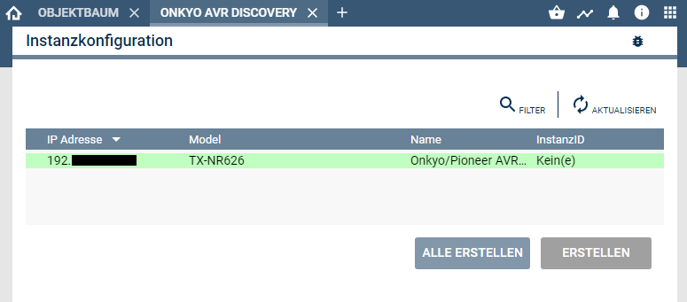

  

  

# Onkyo & Pioneer AVR Discovery  
Sucht kompatible AV Receiver im Netzwerk  

## Dokumentation

**Inhaltsverzeichnis**

1. [Funktionsumfang](#1-funktionsumfang) 
2. [Voraussetzungen](#2-voraussetzungen)
3. [Software-Installation](#3-software-installation)
4. [Verwendung](#4-verwendung)
5. [Statusvariablen und Profile](#5-statusvariablen-und-profile)
6. [WebFront](#6-webfront)
7. [PHP-Befehlsreferenz](#7-php-befehlsreferenz) 
8. [Lizenz](#8-lizenz)

## 1. Funktionsumfang

 - Einfaches Auffinden von Onkyo & Pioneer AV Receivern im lokalen Netzwerk.  
 - Einfaches Einrichten von Konfiguratoren für gefundene Geräte.  

## 2. Voraussetzungen

 - IPS ab Version 5.1  
 - kompatibler AV-Receiver mit LAN-Anschluß (RS232 Geräte werden nicht unterstützt.)  

## 3. Software-Installation

Dieses Modul ist ein Bestandteil des Symcon-Modul: [Onkyo & Pioneer AVR](../)  

## 4. Verwendung

Nach der installation des Moduls fragt Symcon ob es diese Instanz automatisch anlegen soll.  
Anschließend ist im Objektbaum unter 'Discovery Instanzen' eine Instanz 'Onkyo AVR Discovery' vorhanden.  
Beim dem Öffnen der Instanz, werden alle im Netzwerk gefundenen 'AV Receiver' aufgelistet.  
Über das selektieren eines Gerätes in der Tabelle und betätigen des dazugehörigen 'Erstellen' Button, wird ein entsprechender Konfigurator in IPS angelegt.  
Mit diesem Konfigurator können dann die einzelnen Player in IPS erzeugt werden.   
  

## 5. Statusvariablen und Profile

Die Discovery-Instanz besitzt keine Statusvariablen und Variablenprofile.  

## 6. WebFront

Die Discovery-Instanz besitzt keine im WebFront darstellbaren Elemente.  

## 7. PHP-Befehlsreferenz

Die Discovery-Instanz besitzt keine Instanz-Funktionen.  

## 8. Lizenz

  IPS-Modul:  
  [CC BY-NC-SA 4.0](https://creativecommons.org/licenses/by-nc-sa/4.0/)  
