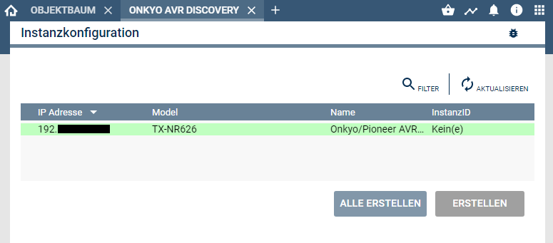

  

   

# Onkyo & Pioneer AVR Discovery <!-- omit in toc -->  

Sucht kompatible AV Receiver im Netzwerk  

## Inhaltsverzeichnis <!-- omit in toc -->

- [1. Funktionsumfang](#1-funktionsumfang)
- [2. Voraussetzungen](#2-voraussetzungen)
- [3. Software-Installation](#3-software-installation)
- [4. Verwendung](#4-verwendung)
- [5. Statusvariablen](#5-statusvariablen)
- [6. Visualisierung](#6-visualisierung)
- [7. PHP-Befehlsreferenz](#7-php-befehlsreferenz)
- [8. Aktionen](#8-aktionen)
- [9. Anhang](#9-anhang)
  - [1. Changelog](#1-changelog)
  - [2. Spenden](#2-spenden)
- [10. Lizenz](#10-lizenz)

## 1. Funktionsumfang

- Einfaches Auffinden von Onkyo & Pioneer AV Receiver im lokalen Netzwerk.  
- Einfaches Einrichten von Konfiguratoren für gefundene Geräte.  

## 2. Voraussetzungen

- Symcon ab Version 8.2  
- kompatibler AV-Receiver mit LAN-Anschluss (RS232 Geräte werden nicht unterstützt.)  

## 3. Software-Installation

Dieses Modul ist ein Bestandteil des Symcon-Modul: [Onkyo & Pioneer AVR](../)  

## 4. Verwendung

Nach der installation des Moduls fragt Symcon ob es diese Instanz automatisch anlegen soll.  
Anschließend ist im Objektbaum unter `Discovery Instanzen` eine Instanz `Onkyo AVR Discovery` vorhanden.  
Bei dem Öffnen der Instanz, werden alle im Netzwerk gefundenen AV Receiver aufgelistet.  
Über das selektieren eines Gerätes in der Tabelle und betätigen des dazugehörigen `Erstellen` Button, wird ein entsprechender [Konfigurator](../OnkyoConfigurator/README.md), inklusive benötigten [Splitter](../OnkyoAVRSplitter/README.md) und ClientSocket, in Symcon angelegt.  
Mit diesem [Konfigurator](../OnkyoConfigurator/README.md#4-einrichten-der-instanzen-in-ip-symcon) können dann die einzelnen Instanzen in Symcon erzeugt werden.  
  

## 5. Statusvariablen

Die Discovery-Instanz besitzt keine Statusvariablen.  

## 6. Visualisierung

Die Discovery-Instanz besitzt keine darstellbaren Elemente.  

## 7. PHP-Befehlsreferenz

Die Discovery-Instanz besitzt keine Instanz-Funktionen.  

## 8. Aktionen

Die Discovery-Instanz unterstützt keine Aktionen.  

## 9. Anhang

### 1. Changelog

[Changelog der Library](../README.md#2-changelog)

### 2. Spenden

Die Library ist für die nicht kommerzielle Nutzung kostenlos, Schenkungen als Unterstützung für den Autor werden hier akzeptiert:  

PayPal:  
  

Wunschliste:  
  

## 10. Lizenz

IPS-Modul:  
[CC BY-NC-SA 4.0](https://creativecommons.org/licenses/by-nc-sa/4.0/)  
