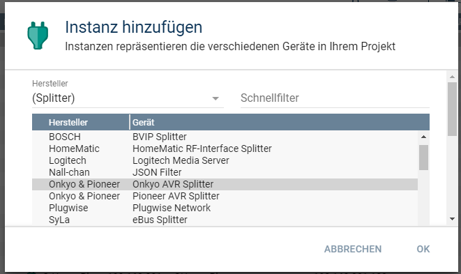

  

  

# Onkyo & Pioneer AVR Splitter (ISCP Splitter)
Ermöglich die Kommunikation von IPS mit einem AV Receiver über das ISCP Protokoll.  

## Dokumentation

**Inhaltsverzeichnis**

1. [Funktionsumfang](#1-funktionsumfang) 
2. [Voraussetzungen](#2-voraussetzungen)
3. [Software-Installation](#3-software-installation)
4. [Einrichten der Instanzen in IP-Symcon](#4-einrichten-der-instanzen-in-ip-symcon)
5. [Statusvariablen und Profile](#5-statusvariablen-und-profile)
6. [WebFront](#6-webfront)
7. [PHP-Befehlsreferenz](#7-php-befehlsreferenz) 
8. [Lizenz](#8-lizenz)

## 1. Funktionsumfang

 - Anbindung von kompatiblen AV Geräte über Netzwerk oder RS232.  
 - Ermitteln der Gerätefähigkeiten bei Netzwerk Receivern.  

## 2. Voraussetzungen

 - IPS ab Version 5.1  
 - kompatibler AV-Receiver mit LAN-Anschluß oder RS232 (RS232 Geräte haben einen eingeschränkten Leistungsumfang)  

## 3. Software-Installation

Dieses Modul ist ein Bestandteil des Symcon-Modul: [Onkyo & Pioneer AVR](../)  

## 4. Einrichten der Instanzen in IP-Symcon

Eine einfache Einrichtung ist über die im Objektbaum unter 'Discovery Instanzen' zu findene Instanz [Onkyo bzw Pioneer AVR Discovery'](../OnkyoAVRDiscovery/readme.md) möglich.  

Bei der manuellen Einrichtung ist das Modul im Dialog 'Instanz hinzufügen' unter den Hersteller 'Onkyo' zufinden.  
  

Alternativ ist es auch in der Liste alle Splitter aufgeführt.  
  

In dem sich öffnenden Konfigurationsformular sind keine Einstellungen vorzunehmen.  

## 5. Statusvariablen und Profile

Der Splitter besitzt keine Statusvariablen und Variablenprofile, wenn es sich um ein RS232 Gerät handelt.  
Bei einem Netzwerk Gerät wird versucht das Model und die Firmware auszulesen und bei Erfolg als Statusvariablen abgebildet.  
 

**Statusvariablen bei Netzwerk-Geräten:**  

| Name                        | Typ     | Ident          | Beschreibung                                                   |
| :-------------------------: | :-----: | :------------: | :------------------------------------------------------------: |
| Firmware                    | string  | Firmware       | Firmware-Version des Gerätes.                                  |
| Model                       | string  | Model          | Model / Typ des Gerätes.                                       |

## 6. WebFront

Sollen eventuell vorhandene Statusvariablen im WebFront angezeigt werden, so müssen diese verlinkt werden.  

## 7. PHP-Befehlsreferenz

Der Splitter besitzt keine Instanz-Funktionen.  

## 8. Lizenz

  IPS-Modul:  
  [CC BY-NC-SA 4.0](https://creativecommons.org/licenses/by-nc-sa/4.0/)  
