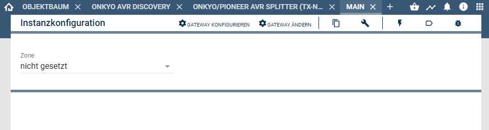
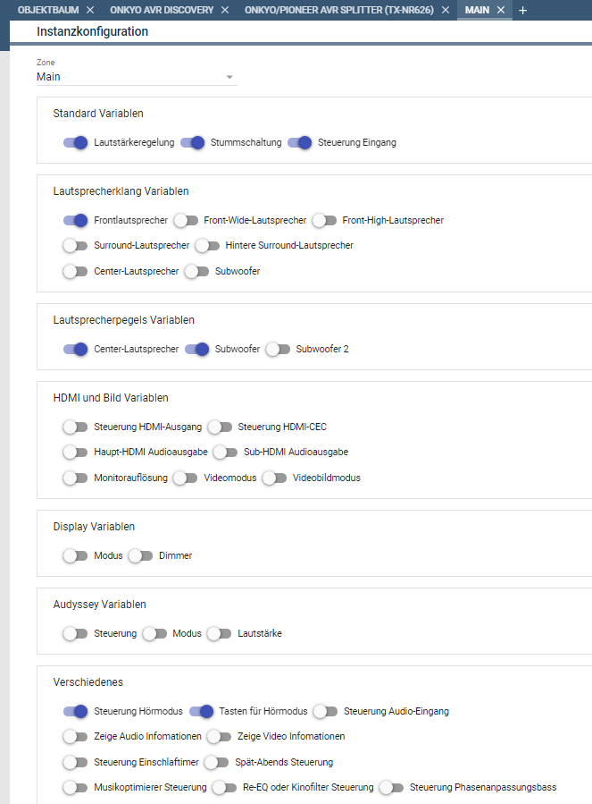
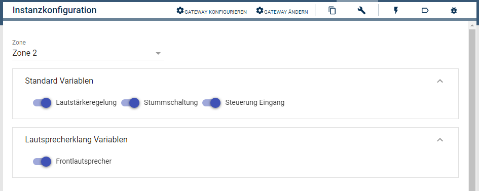
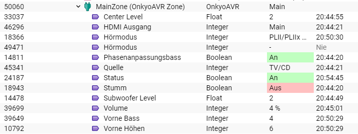
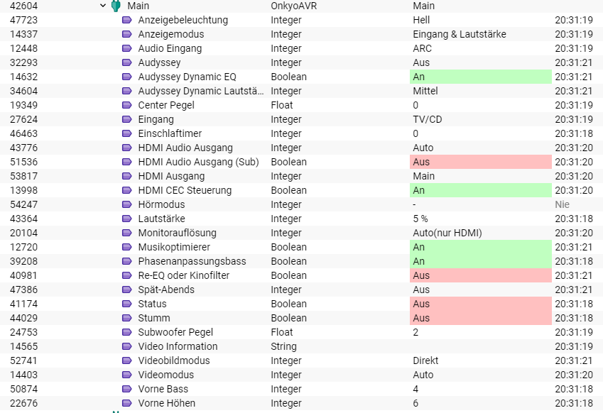
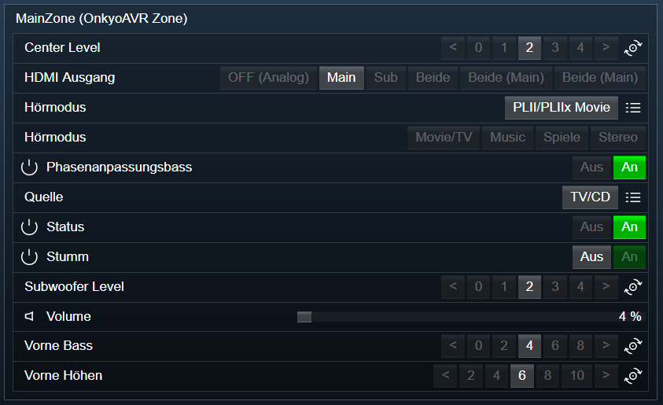

[](https://www.symcon.de/service/dokumentation/entwicklerbereich/sdk-tools/sdk-php/)
[]()
[](https://www.symcon.de/forum/threads/30857-IP-Symcon-5-1-%28Stable%29-Changelog)
[](https://creativecommons.org/licenses/by-nc-sa/4.0/)
[](https://github.com/Nall-chan/OnkyoAVR/actions) [](https://github.com/Nall-chan/OnkyoAVR/actions)  

# Onkyo & Pioneer AVR Zone (Onkyo AVR)
Bildet eine der Zones eines Gerätes in IP-Symcon ab.  

## Inhaltsverzeichnis <!-- omit in toc -->

- [1. Funktionsumfang](#1-funktionsumfang)
- [2. Voraussetzungen](#2-voraussetzungen)
- [3. Software-Installation](#3-software-installation)
- [4. Einrichten der Instanzen in IP-Symcon](#4-einrichten-der-instanzen-in-ip-symcon)
- [5. Statusvariablen und Profile](#5-statusvariablen-und-profile)
- [6. WebFront](#6-webfront)
- [7. PHP-Befehlsreferenz](#7-php-befehlsreferenz)
- [8. Lizenz](#8-lizenz)

## 1. Funktionsumfang

 - Darstellen von Zuständen der Zone.    
 - Bedienung aus dem WebFront.  
 - Bereitstellung von PHP-Befehlen zur Steuerung durch Scripte.  

## 2. Voraussetzungen

 - IPS ab Version 5.1  
 - kompatibler AV-Receiver mit LAN-Anschluss oder RS232 (RS232 Geräte haben einen eingeschränkten Leistungsumfang)  

## 3. Software-Installation

Dieses Modul ist ein Bestandteil des Symcon-Modul: [Onkyo & Pioneer AVR](../)  

## 4. Einrichten der Instanzen in IP-Symcon

Eine einfache Einrichtung ist über die im Objektbaum unter 'Konfigurator' zu findende Instanz [Onkyo bzw Pioneer Configurator'](../OnkyoConfigurator/) möglich.  

Bei der manuellen Einrichtung ist das Modul im Dialog 'Instanz hinzufügen' unter den Hersteller 'Onkyo' zu finden.  
  

In dem sich öffnenden Konfigurationsformular ist die gewünschte Zone auszuwählen.  
Weitere Einstellungen ergeben sich auch der gewählten Zone.  
Viele Funktionen stehen nur in der 'MainZone' zur Verfügung.  
Zone 2, 3 und 4 haben, je nach Gerät, ein deutlich kleineres Spektrum an verfügbaren Einstellungen und Funktionen.  
  

**Beispiel Konfiguration MainZone:**  
  
**Beispiel Konfiguration Zone 2:**  
  

## 5. Statusvariablen und Profile

Jede Zone erstellt ihre Statusvariablen und einige Profile dynamisch, je nach Fähigkeiten der Geräte/Zonen und der Instanz-Konfiguration. 
Es können in der Konfiguration bestimmte Statusvariablen ab/angewählt werden.  
Diese werden jedoch nur erzeugt, wenn das Gerät auch eine (sinnvolle) Antwort liefert.  
**Beispiel Main Zone, Werkseinstellungen:**  
  
**Beispiel Main Zone bei TX-626 mit allen Funktionen in der Instanz aktiviert:**  
  

Die Statusvariablen können in der Konfiguration der Instanz aktiviert / desaktiviert werden.  

**Statusvariablen MainZone:**  

|            Name             |   Typ   | Ident |                Beschreibung                |
| :-------------------------: | :-----: | :---: | :----------------------------------------: |
|            Power            | boolean |  PWR  |        Zone ein- oder ausgeschaltet        |
|           Volume            | integer |  MVL  |                 Lautstärke                 |
|            Mute             | boolean |  AMT  |       Stummschaltung aktiv / desaktiv       |
|           Eingang           | integer |  SLI  |         Audio/Video Eingangsquelle         |
|         Vorne Höhen         | integer | TFR0  |          Frontlautsprecher Höhen           |
|         Vorne Bass          | integer | TFR1  |           Frontlautsprecher Bass           |
|     Vorne außen Höhen      | integer | TFW0  |       Front-Wide-Lautsprecher Höhen        |
|      Vorne außen Bass      | integer | TFW1  |        Front-Wide-Lautsprecher Bass        |
|      Vorne oben Höhen       | integer | TFH0  |       Front-High-Lautsprecher Höhen        |
|       Vorne oben Bass       | integer | TFH1  |        Front-High-Lautsprecher Bass        |
|       Surround Höhen        | integer | TSR0  |        Surround-Lautsprecher Höhen         |
|        Surround Bass        | integer | TSR1  |         Surround-Lautsprecher Bass         |
|    Surround hinten Höhen    | integer | TSB0  |    Hintere Surround-Lautsprecher Höhen     |
|    Surround hinten Bass     | integer | TSB1  |     Hintere Surround-Lautsprecher Bass     |
|        Center Höhen         | integer | TCT0  |         Center-Lautsprecher Höhen          |
|         Center Bass         | integer | TCT1  |          Center-Lautsprecher Bass          |
|       Subwoofer Bass        | integer | TSW0  |               Subwoofer Bass               |
|        Center Pegel         | integer |  CTL  |           Center Pegelanpassung            |
|       Subwoofer Pegel       | integer |  SWL  |          Subwoofer Pegelanpassung          |
|      Subwoofer 2 Pegel      | integer |  SW2  |         Subwoofer 2 Pegelanpassung         |
|        Anzeigemodus         | integer |  DIF  |            Display Anzeigemodus            |
|     Anzeigebeleuchtung      | integer |  DIM  |            Display Beleuchtung             |
|      Audio Information      | string  |  IFA  | Audio Information der aktuellen Wiedergabe |
|      Video Information      | string  |  IFV  | Video Information der aktuellen Wiedergabe |
|        Audio Eingang        | integer |  SLA  |            Audio Eingangsquelle            |
|        HDMI Ausgang         | integer |  HDO  |                HDMI Ausgang                |
|     HDMI Audio Ausgang      | integer |  HAO  |             HDMI Audio Ausgang             |
|  HDMI Audio Ausgang (Sub)   | boolean |  HAS  |  HDMI Audio Ausgang (Sub) aktiv / desaktiv  |
|     HDMI CEC Steuerung      | boolean |  CEC  |     HDMI CEC Steuerung aktiv / desaktiv     |
|      Monitorauflösung       | integer |  RES  |              Monitorauflösung              |
|         Videomodus          | integer |  VWM  |                 Videomodus                 |
|       Videobildmodus        | integer |  VPM  |               Videobildmodus               |
|          Hörmodus           | integer |  LMD  |                  Hörmodus                  |
|          Hörmodus           | integer | LMD2  |        Aktions-Tasten für Hörmodus         |
|         Spät-Abends         | integer |  LTN  |   HTML-Box mit der Playlist des Players    |
|    Re-EQ oder Kinofilter    | boolean |  RAS  |   Re-EQ oder Kinofilter aktiv / desaktiv    |
|       Audyssey Modus        | integer |  ADY  |               Audyssey Modus               |
|     Audyssey Dynamic EQ     | boolean |  ADQ  |          Audyssey aktiv / desaktiv          |
| Audyssey Dynamic Lautstärke | integer |  ADV  |            Audyssey Lautstärke             |
|       Musikoptimierer       | boolean |  MOT  |      Musikoptimierer aktiv / desaktiv       |
|    Phasenanpassungsbass     | boolean |  PMB  |    Phasenanpassungsbass aktiv / desaktiv    |
|       EinschlafTimer        | integer |  SLP  |               EinschlafTimer               |

**Statusvariablen Zone 2:**  

|  Name   |   Typ   | Ident |          Beschreibung          |
| :-----: | :-----: | :---: | :----------------------------: |
|  Power  | boolean |  ZPW  |  Zone ein- oder ausgeschaltet  |
| Volume  | integer |  ZVL  |           Lautstärke           |
|  Mute   | boolean |  ZMT  | Stummschaltung aktiv / desaktiv |
| Eingang | integer |  SLZ  |   Audio/Video Eingangsquelle   |
|  Höhen  | integer | ZTN0  |       Lautsprecher Höhen       |
|  Bass   | integer | ZTN0  |       Lautsprecher Bass        |

**Statusvariablen Zone 3:**  

|  Name   |   Typ   | Ident |          Beschreibung          |
| :-----: | :-----: | :---: | :----------------------------: |
|  Power  | boolean |  PW3  |  Zone ein- oder ausgeschaltet  |
| Volume  | integer |  VL3  |           Lautstärke           |
|  Mute   | boolean |  MT3  | Stummschaltung aktiv / desaktiv |
| Eingang | integer |  SL3  |   Audio/Video Eingangsquelle   |
|  Höhen  | integer | TN30  |       Lautsprecher Höhen       |
|  Bass   | integer | TN31  |       Lautsprecher Bass        |

**Statusvariablen Zone 4:**  

|  Name   |   Typ   | Ident |          Beschreibung          |
| :-----: | :-----: | :---: | :----------------------------: |
|  Power  | boolean |  PW4  |  Zone ein- oder ausgeschaltet  |
| Volume  | integer |  VL4  |           Lautstärke           |
|  Mute   | boolean |  MT4  | Stummschaltung aktiv / desaktiv |
| Eingang | integer |  SL4  |   Audio/Video Eingangsquelle   |
|         |
**Profile**:
 
 Alle Profile mit .* am Ende, enthalten immer die InstanzID und sind dynamische Profile.  
 Diese können sich während des Betriebes, oder beim ändern von Geräteeinstellungen dynamisch verändern.  

|          Name           |   Typ   |   verwendet von Statusvariablen  (Ident)    |
| :---------------------: | :-----: | :-----------------------------------------: |
|     Onkyo.Volume.*      | integer |             MVL, ZVL, VL3, VL4              |
|   Onkyo.ToneOffset.*    | integer | TRF, TFW, TFH, TCT, TSR, TSB, TSW, ZTN, TN3 |
|   Onkyo.CenterLevel.*   |  float  |                     CTL                     |
| Onkyo.SubwooferLevel.*  |  float  |                     SWL                     |
| Onkyo.Subwoofer2Level.* |  float  |                     SW2                     |
|   Onkyo.SelectInput.*   | integer |             SLI, SLZ, SL3, SL4              |
|        Onkyo.LMD        | integer |                     LMD                     |
|    Onkyo.SelectLMD.*    | integer |                    LMD2                     |
| Onkyo.SelectInputAudio  | integer |                     SLA                     |
|    Onkyo.DisplayMode    | integer |                     DIF                     |
|   Onkyo.DisplayDimmer   | integer |                     DIM                     |
|    Onkyo.HDMIOutput     | integer |                     HDO                     |
|  Onkyo.HDMIAudioOutput  | integer |                     HAO                     |
|  Onkyo.VideoResolution  | integer |                     RES                     |
|   Onkyo.VideoWideMode   | integer |                     VWM                     |
| Onkyo.VideoPictureMode  | integer |                     VPM                     |
|     Onkyo.LateNight     | integer |                     LTN                     |
|     Onkyo.Audyssey      | integer |                     ADY                     |
|  Onkyo.AudysseyDynamic  | integer |                     ADV                     |
|       Onkyo.Sleep       | integer |                     SLP                     |

## 6. WebFront

Die direkte Darstellung im WebFront ist möglich, es wird aber empfohlen mit Links zu arbeiten.  

**Beispiel Main Zone, Werkseinstellungen:**  
  


## 7. PHP-Befehlsreferenz

**Schaltbare Statusvariablen können universell mit RequestAction angesteuert werden.**  
Siehe Symcon Dokumentation: [RequestAction](https://www.symcon.de/service/dokumentation/befehlsreferenz/variablenzugriff/requestaction/)

---  

**Folgende Funktionen liefern 'TRUE'  bei Erfolg.  
Im Fehlerfall wird eine Warnung erzeugt und 'FALSE' zurückgegeben.**  


```php
bool OAVR_RequestState(int $InstanzeID, string $Ident);
```
Fordert den aktuellen Wert einer Statusvariable beim Gerät an.  

```php
bool OAVR_PowerOn(int $InstanzeID);
```
Einschalten der Zone.  

```php
bool OAVR_PowerOff(int $InstanzeID);
```
Ausschalten der Zone.  

```php
bool OAVR_Power(int $InstanzeID);
```
Umschalten der Zone.  

```php
bool OAVR_SetVolume(int $InstanzeID, int $Value);
```
Lautstärke der Zone setzen. 'Value' ist der absolute Wert (z.B. 0-80).
  
```php
bool OAVR_SetMute(int $InstanzeID, bool $Value);
```
Stummschaltung wird mit 'Value' bei 'True' aktiviert und bei 'False' desaktiviert.  

```php
bool OAVR_SelectInput(int $InstanzeID, int $Value);
```
Eingangsquelle der Zone wählen.  
Dabei kann 'Value' je nach Gerät und Zone nur bestimmte Werte haben.  
Gültige Werte sind im VariablenProfil 'Onkyo.SelectInput.<InstanzId>' zu finden.  
Beispielwerte aus der API sind:  

| Wert  |     Eingang     |
| :---: | :-------------: |
|   0   | Video 1 VCR/DVR |
|   1   | Video 2 CBL/SAT |
|   2   | Video 3 GAME/TV |
|   3   |  Video 4 AUX1   |
|   4   |  Video 5 AUX2   |
|   5   |   Video 6 PC    |
|  16   |     BD/DVD      |
|  18   |       TV        |
|  32   |     TAPE 1      |
|  34   |      PHONO      |
|  35   |      TV/CD      |
|  36   |   Tuner (FM)    |
|  37   |   Tuner (AM)    |
|  41   |   USB(Front)    |
|  43   |     Network     |
|  45   |     Airplay     |
|  46   |    Bluetooth    |
|  64   | Universal PORT  |

```php
bool OAVR_SelectAudioInput(int $InstanzeID, int $Value);
```
Audioquelle der Zone wählen.  
Dabei kann 'Value' je nach Gerät und Zone nur bestimmte Werte haben.  
Beispielwerte sind im VariablenProfil 'Onkyo.SelectInputAudio' zu finden.  
Werte aus der API sind:  

| Wert  |    Eingang    |
| :---: | :-----------: |
|   0   |     AUTO      |
|   1   | MULTI-CHANNEL |
|   2   |    ANALOG     |
|   3   |     iLINK     |
|   4   |     HDMI      |
|   5   |   COAX/OPT    |
|   6   |    BALANCE    |
|   7   |      ARC      |
|  15   |    Keiner     |

```php
bool OAVR_SelectListingMode(int $InstanzeID, int $Value);
```
Hörmodus der Zone wählen.  
Dabei kann 'Value' je nach Gerät und Zone nur bestimmte Werte haben.  
Beispielwerte sind im VariablenProfil 'Onkyo.LMD' zu finden.  
Werte aus der API sind, u.a.:  

| Wert  |               Hörmodus                |
| :---: | :-----------------------------------: |
|  00   |                STEREO                 |
|  01   |                DIRECT                 |
|  02   |               SURROUND                |
|  03   |                 FILM                  |
|  04   |                  THX                  |
|  05   |                ACTION                 |
|  06   |                MUSICAL                |
|  08   |               ORCHESTRA               |
|  09   |               UNPLUGGED               |
|  11   |              STUDIO-MIX               |
|  12   |               TV LOGIC                |
|  13   |             ALL CH STEREO             |
|  14   |          THEATER-DIMENSIONAL          |
|  15   |               ENHANCED                |
|  16   |                 MONO                  |
|  18   |              PURE AUDIO               |
|  19   |               FULL MONO               |
|  64   |            Straight Decode            |
|  66   |              THX Cinema               |
|  67   |            THX Surround EX            |
|  68   |               THX Music               |
|  69   |               THX Games               |
|  80   | THX Cinema Mode, THX U2/S2/I/S Cinema |
|  81   |  THX Music Mode, THX U2/S2/I/S Music  |
|  82   |  THX Games Mode, THX U2/S2/I/S Games  |
|  128  |           PLII/PLIIx Movie            |
|  129  |           PLII/PLIIx Music            |
|  130  |       Neo:6 Cinema/Neo:X Cinema       |
|  131  |        Neo:6 Music/Neo:X Music        |
|  132  |         PLII/PLIIx THX Cinema         |
|  133  |        Neo:6/Neo:X THX Cinema         |
|  134  |            PLII/PLIIx Game            |
|  137  |         PLII/PLIIx THX Games          |
|  138  |         Neo:6/Neo:X THX Games         |
|  139  |         PLII/PLIIx THX Music          |
|  140  |         Neo:6/Neo:X THX Music         |

```php
bool OAVR_SetSleep(int $InstanzeID, int $Duration);
```
Aktiviert den AusschaltTimer mit den in 'Duration' übergeben Wert in Sekunden.  

```php
bool OAVR_SetSubwooferLevel(int $InstanzeID, float $Level);
```
Setzt den Level des Subwoofer auf den in 'Level' übergeben Wert.  
Je nach Gerät sind verschiedene min/max Werte zulässig.  
Ein gültige Wertebereich ist im VariablenProfil 'Onkyo.SubwooferLevel.<InstanzId>' zu finden. 

```php
bool OAVR_SetSubwoofer2Level(int $InstanzeID, float $Level);
```
Entspricht 'OAVR_SetSubwooferLevel', nur für den zweiten Subwoofer (sofern vorhanden).  

```php
bool OAVR_SetDisplayMode(int $InstanzeID, int $Value);
```
Setzt den Anzeigemodus des Display.  
'Value' muss einen der folgenden Werte enthalten.  

| Wert  |      Anzeigemodus      |
| :---: | :--------------------: |
|   0   |     Input & Volume     |
|   1   | Input & Listening Mode |
|   2   |     Digital Format     |
|   3   |      Video Format      |

```php
bool OAVR_SetDisplayDimmer(int $InstanzeID, int $Level);
```
Setzt die Helligkeit des Display.  
'Level' muss einen der folgenden Werte enthalten.  

| Wert  |    Helligkeit    |
| :---: | :--------------: |
|   0   |       Hell       |
|   1   |      Mittel      |
|   2   |      Dunkel      |
|   3   |       Aus        |
|   8   | Hell und LED aus |

```php
array OAVR_GetAudioInformation(int $InstanzeID);
```
Liefert ein Array mit bekannten Informationen zum Audiosignal.  
Bei nicht bekannten Daten, ist der Wert leer.  
            'Audio Input Port',  
            'Input Signal Format',  
            'Sampling Frequency',  
            'Input Signal Channel',  
            'Listening Mode',  
            'Output Signal Channel',  
            'Output Sampling Frequency',  
            'PQLS',  
            'Auto Phase Control Current Delay',  
            'Auto Phase Control Phase',  
            'Upmix Mode'  


```php
array OAVR_GetVideoInformation(int $InstanzeID);
```
Liefert ein Array mit bekannten Informationen zum Videosignal.  
Bei nicht bekannten Daten, ist der Wert leer.  
            'Video Input Port',  
            'Input Resolution',  
            'RGB/YCbCr',  
            'Color Depth',  
            'Video Output Port',  
            'Output Resolution',  
            'RGB/YCbCr',  
            'Color Depth',  
            'Picture Mode'  

## 8. Lizenz

  IPS-Modul:  
  [CC BY-NC-SA 4.0](https://creativecommons.org/licenses/by-nc-sa/4.0/)  
