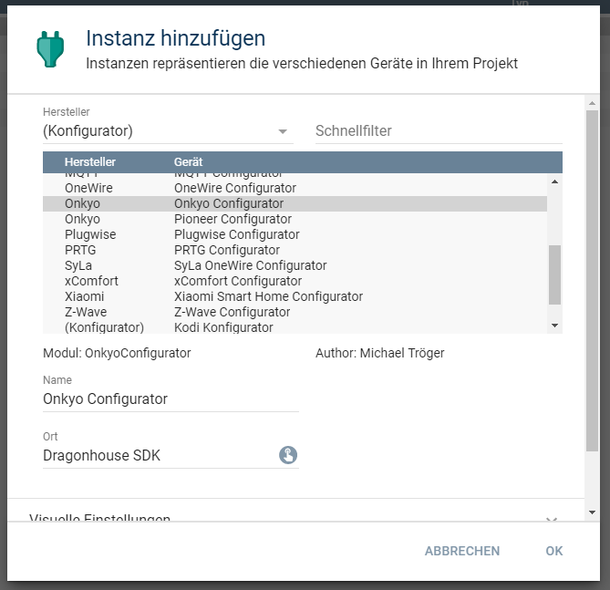
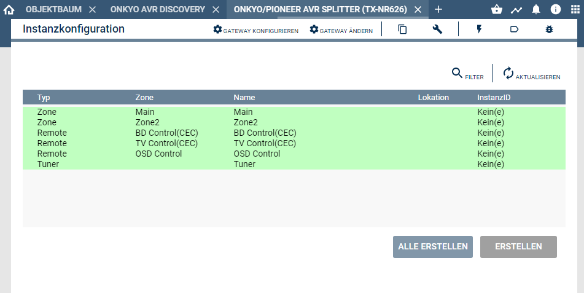

   

# Onkyo & Pioneer Configurator  
Vereinfacht das Anlegen von verschiedenen Instanzen für einen AV-Receiver.    

## Inhaltsverzeichnis <!-- omit in toc -->
- [1. Funktionsumfang](#1-funktionsumfang)
- [2. Voraussetzungen](#2-voraussetzungen)
- [3. Software-Installation](#3-software-installation)
- [4. Einrichten der Instanzen in IP-Symcon](#4-einrichten-der-instanzen-in-ip-symcon)
- [5. Statusvariablen und Profile](#5-statusvariablen-und-profile)
- [6. WebFront](#6-webfront)
- [7. PHP-Befehlsreferenz](#7-php-befehlsreferenz)
- [8. Lizenz](#8-lizenz)

## 1. Funktionsumfang

 - Auslesen und darstellen aller vom Gerät bekannten Zonen und Funktionen.  
 - Einfaches Anlegen von neuen Instanzen in IPS.  

## 2. Voraussetzungen

 - IPS ab Version 5.1  
 - kompatibler AV-Receiver mit LAN-Anschluss (RS232 Geräte werden nicht unterstützt.)  

## 3. Software-Installation

Dieses Modul ist ein Bestandteil des Symcon-Modul: [Onkyo & Pioneer AVR](../)  

## 4. Einrichten der Instanzen in IP-Symcon

Eine einfache Einrichtung ist über die im Objektbaum unter 'Discovery Instanzen' zu findende Instanz [Onkyo bzw Pioneer AVR Discovery'](../OnkyoAVRDiscovery/readme.md) möglich.  

Bei der manuellen Einrichtung ist das Modul im Dialog 'Instanz hinzufügen' unter den Hersteller 'Onkyo' zu finden.  
  

Alternativ ist es auch in der Liste alle Konfiguratoren aufgeführt.  
  

Es wird automatisch eine [ISCP Splitter](../OnkyoAVRSplitter/) Instanz erzeugt.  
Anschließend muss die IP-Adresse des AVR im sich öffnenden Dialog eingetragen werden.  

Werden in dem sich öffnenden Konfigurationsformular keine Geräte angezeigt, so ist entweder die Verbindung zum Gerät unterbrochen oder dieses Gerät unterstützt das für den Konfigurator benötigte Kommando nicht.  
Über sie Schaltfläche 'Gateway konfigurieren' und dann 'Schnittstelle konfigurieren' kann der Dialog für die IP-Adresse erneut geöffnet werden.  

Ist der Splitter korrekt verbunden, und unterstützt das Gerät die automatische Ermittlung der Fähigkeiten, wird beim öffnen des Konfigurator folgendender Dialog angezeigt.  
Der Inhalt kann je nach Typ unterschiedlich ausfallen.  
  

Über das selektieren eines Eintrages in der Tabelle und betätigen des dazugehörigen 'Erstellen' Button,  
können Instanzen in IPS angelegt werden.  
Alternativ können auch alle Instanzen über den Button 'Alle erstellen' in Symcon angelegt werden.  

## 5. Statusvariablen und Profile

Der Konfigurator besitzt keine Statusvariablen und Variablenprofile.  

## 6. WebFront

Der Konfigurator besitzt keine im WebFront darstellbaren Elemente.  

## 7. PHP-Befehlsreferenz

Der Konfigurator besitzt keine Instanz-Funktionen.  

## 8. Lizenz

  IPS-Modul:  
  [CC BY-NC-SA 4.0](https://creativecommons.org/licenses/by-nc-sa/4.0/)  
