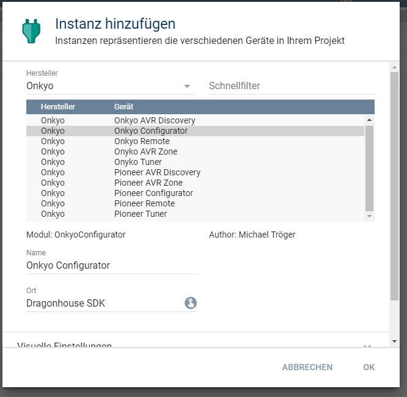
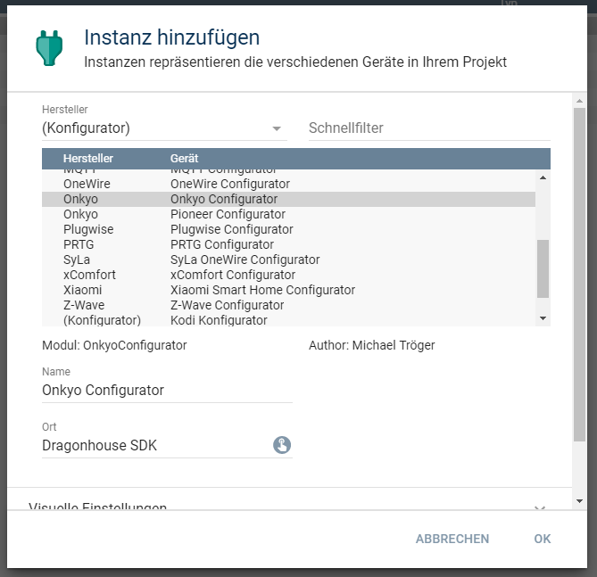
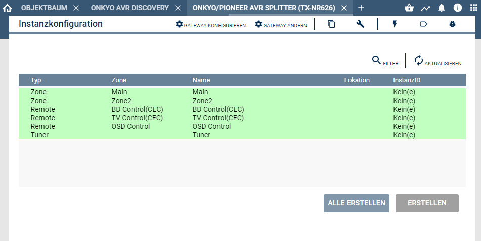

  

   

# Onkyo & Pioneer Configurator  <!-- omit in toc -->

Vereinfacht das Anlegen von verschiedenen Instanzen für einen AV-Receiver.  

## Inhaltsverzeichnis <!-- omit in toc -->

- [1. Funktionsumfang](#1-funktionsumfang)
- [2. Voraussetzungen](#2-voraussetzungen)
- [3. Software-Installation](#3-software-installation)
- [4. Einrichten der Instanzen in IP-Symcon](#4-einrichten-der-instanzen-in-ip-symcon)
- [5. Statusvariablen](#5-statusvariablen)
- [6. Visualisierung](#6-visualisierung)
- [7. PHP-Befehlsreferenz](#7-php-befehlsreferenz)
- [8. Aktionen](#8-aktionen)
- [9. Anhang](#9-anhang)
  - [1. Changelog](#1-changelog)
  - [2. Spenden](#2-spenden)
- [10. Lizenz](#10-lizenz)

## 1. Funktionsumfang

- Auslesen und darstellen aller vom Gerät bekannten Zonen und Funktionen.  
- Einfaches Anlegen von neuen Instanzen in Symcon.  

## 2. Voraussetzungen

- Symcon ab Version 8.2  
- kompatibler AV-Receiver mit LAN-Anschluss (RS232 Geräte werden nicht unterstützt.)  

## 3. Software-Installation

Dieses Modul ist ein Bestandteil des Symcon-Modul: [Onkyo & Pioneer AVR](../)  

## 4. Einrichten der Instanzen in IP-Symcon

Eine einfache Einrichtung ist über die im Objektbaum unter `Discovery Instanzen` zu findende Instanz [Onkyo bzw. Pioneer AVR Discovery](../OnkyoAVRDiscovery/readme.md#4-verwendung) möglich.  

Bei der manuellen Einrichtung ist das Modul im Dialog `Instanz hinzufügen` unter den Hersteller `Onkyo` zu finden.  
  

Alternativ ist es auch in der Liste alle Konfiguratoren aufgeführt.  
  

Es wird automatisch eine [ISCP Splitter-Instanz](../OnkyoAVRSplitter/README.md) erzeugt.  
Anschließend muss die IP-Adresse des AVR im sich öffnenden Dialog eingetragen werden.  

Werden in dem sich öffnenden Konfigurationsformular keine Geräte angezeigt, so ist entweder die Verbindung zum Gerät unterbrochen oder dieses Gerät unterstützt das für den Konfigurator benötigte Kommando nicht.  
Über sie Schaltfläche `Gateway konfigurieren` und dann `Schnittstelle konfigurieren` kann der Dialog für die IP-Adresse erneut geöffnet werden.  

Ist der Splitter korrekt verbunden, und unterstützt das Gerät die automatische Ermittlung der Fähigkeiten, wird beim öffnen des Konfigurator folgender Dialog angezeigt.  
Der Inhalt kann je nach Typ unterschiedlich ausfallen.  
  

Über das selektieren eines Eintrages in der Tabelle und betätigen des dazugehörigen `Erstellen` Button,  
können Instanzen in Symcon angelegt werden.  
Alternativ können auch alle Instanzen über den Button `Alle erstellen` in Symcon angelegt werden.  

## 5. Statusvariablen

Die Konfigurator-Instanz besitzt keine Statusvariablen.  

## 6. Visualisierung

Die Konfigurator-Instanz besitzt keine darstellbaren Elemente.  

## 7. PHP-Befehlsreferenz

Die Konfigurator-Instanz besitzt keine Instanz-Funktionen.  

## 8. Aktionen

Die Konfigurator-Instanz unterstützt keine Aktionen.  

## 9. Anhang

### 1. Changelog

[Changelog der Library](../README.md#2-changelog)

### 2. Spenden

Die Library ist für die nicht kommerzielle Nutzung kostenlos, Schenkungen als Unterstützung für den Autor werden hier akzeptiert:  

PayPal:  
  

Wunschliste:  
  

## 10. Lizenz

IPS-Modul:  
[CC BY-NC-SA 4.0](https://creativecommons.org/licenses/by-nc-sa/4.0/)  
