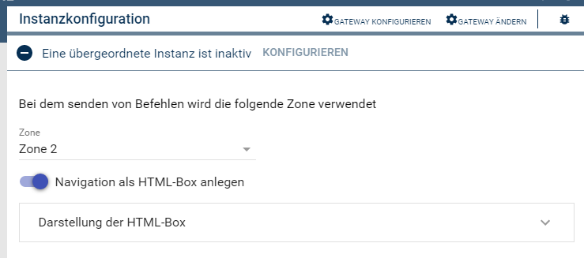
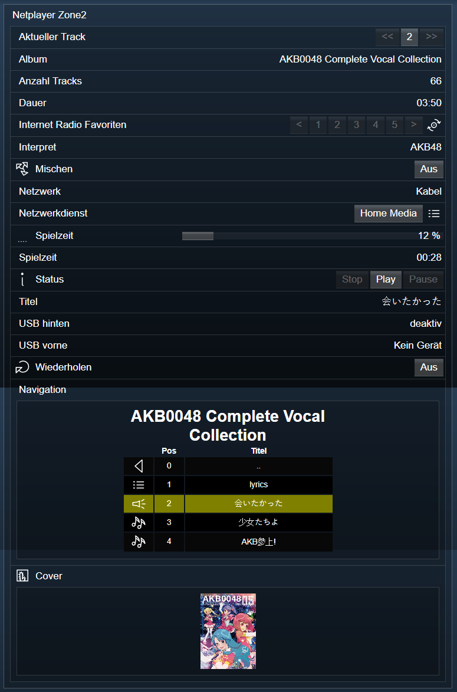

[](https://www.symcon.de/service/dokumentation/entwicklerbereich/sdk-tools/sdk-php/)
[]()
[](https://creativecommons.org/licenses/by-nc-sa/4.0/)  
[](https://www.symcon.de/forum/threads/30857-IP-Symcon-5-1-%28Stable%29-Changelog)
[](https://styleci.io/repos/45338104)  

# Onkyo & Pioneer AVR NetPlayer (Onkyo Netplayer)
Bildet die Netzwerkfunktionen eines Gerätes in IP-Symcon ab.  

## Dokumentation

**Inhaltsverzeichnis**

1. [Funktionsumfang](#1-funktionsumfang) 
2. [Voraussetzungen](#2-voraussetzungen)
3. [Software-Installation](#3-software-installation)
4. [Einrichten der Instanzen in IP-Symcon](#4-einrichten-der-instanzen-in-ip-symcon)
5. [Statusvariablen und Profile](#5-statusvariablen-und-profile)
6. [WebFront](#6-webfront)
7. [PHP-Befehlsreferenz](#7-php-befehlsreferenz) 
8. [Lizenz](#8-lizenz)

## 1. Funktionsumfang

 - Darstellen von Zuständen des Netzwerkplayers.    
 - Bedienung aus dem WebFront.  
 - Bereitstellung von PHP-Befehlen zur Steuerung durch Scripte.  

## 2. Voraussetzungen

 - IPS ab Version 5.1  
 - kompatibler AV-Receiver mit LAN-Anschluß  

## 3. Software-Installation

Dieses Modul ist ein Bestandteil des Symcon-Modul: [Onkyo & Pioneer AVR](../)  

## 4. Einrichten der Instanzen in IP-Symcon

Eine einfache Einrichtung ist über die im Objektbaum unter 'Konfigurator' zu findene Instanz [Onkyo bzw Pioneer Configurator'](../OnkyoConfigurator/readme.md) möglich.  

Bei der manuellen Einrichtung ist das Modul im Dialog 'Instanz hinzufügen' unter den Hersteller 'Onkyo' zufinden.  
  

In dem sich öffnenden Konfigurationsformular ist die gewünschte Zone auszuwählen, welche beim senden vom Kommandos an das Gerät benutzt wird.  
  

**Konfiguration HTML-Box zur Steuerung:**  
  

## 5. Statusvariablen und Profile

Jede Instanz erstellt einige Profile dynamisch, je nach Fähigkeiten der Geräte.  

**Statusvariablen MainZone:**  

| Name                        | Typ     | Ident     | Beschreibung                                              |
| :-------------------------: | :-----: | :-------: | :-------------------------------------------------------: |
| Internet Radio Favoriten    | integer | NPR       | Favorit aufrufen                                          |
| Status                      | integer | NST0      | Status der Wiedergabe                                     |
| Wiederholen                 | integer | NST1      | Wiederholung durchschalten                                |
| Mischen                     | integer | NST2      | Mischen durchschalten                                     |
| Aktueller Track             | integer | NTR0      | Aktueller Track der Wiedergabe                            |
| Anzahl Tracks               | integer | NTR1      | Anzahl von Tracks welche gespielt werden                  |
| Spielzeit                   | string  | NTM0      | Aktuelle Position im aktuellen Track                      |
| Dauer                       | string  | NTM1      | Laufzeit des Track                                        |
| Spielzeit                   | integer | NTM       | Aktuelle Position in Prozent                              |
| Album                       | string  | NAL       | Album des aktuellen Track                                 |
| Titel                       | string  | NTI       | Titel des aktuellen Track                                 |
| Interpret                   | string  | NAT       | Interpret des aktuellen Track                             |
| Netzwerk                    | integer | NDS0      | Status Netzwerkanschluß                                   |
| USB vorne                   | integer | NDS1      | Erkanntes Gerät an USB-Anschluß                           |
| USB hinten                  | integer | NDS2      | Erkanntes Gerät an USB-Anschluß                           |
| Netzwerkdienst              | integer | NSV       | Aktiver Netzwerkdienst                                    |


**Profile**:
 
 Alle Profile mit .* am Ende, enthalten immer die InstanzID und sind dynamische Profile.  
 Diese können sich während des Betriebes, oder beim ändern von Geräteeinstellungen dynamisch verändern.  

| Name                          | Typ     | verwendet von Statusvariablen  (Ident) |
| :---------------------------: | :-----: | :------------------------------------: |
| Onkyo.NetTunerPreset          | integer | NPR                                    |
| Onkyo.Status                  | integer | NST0                                   |
| Onkyo.Repeat.*                | integer | NST1                                   |
| Onkyo.Shuffle.*               | integer | NST2                                   |
| Onkyo.Tracks                  | integer | NTR0                                   |
| Onkyo.Network                 | integer | NDS0                                   |
| Onkyo.USB                     | integer | NDS1, NDS2                             |
| Onkyo.SelectNetworkService.*  | integer | NSV                                    |

## 6. WebFront

Die direkte Darstellung im WebFront ist möglich, es wird aber empfohlen mit Links zu arbeiten.  

  


## 7. PHP-Befehlsreferenz

**Folgende Funktionen liefern 'TRUE' oder ein Array bei Erfolg.  
Im Fehlerfall wird eine Warnung erzeugt und 'FALSE' zurückgegeben.**  


```php
bool OAVR_RequestState(int $InstanzeID, string $Ident);
```
Fordert den aktuellen Wert einer Statusvariable beim Gerät an.  

```php
bool OAVR_Menu(int $InstanzeID);
```
Senden den Tastendruck 'Menü' an das Gerät.  

```php
bool OAVR_PreviousTrack(int $InstanzeID);
```
Spring einen Track zurück.  
  
```php
bool OAVR_NextTrack(int $InstanzeID);
```
Springt einen Track vor.  
  
```php
bool OAVR_Play(int $InstanzeID);
```
Senden den Tastendruck 'Play' an das Gerät.  
  
```php
bool OAVR_Pause(int $InstanzeID);
```
Senden den Tastendruck 'Pause' an das Gerät.  
  
```php
bool OAVR_Stop(int $InstanzeID);
```
Senden den Tastendruck 'Stop' an das Gerät.  
  
```php
bool OAVR_Shuffle(int $InstanzeID);
```
Senden den Tastendruck 'Shuffle' an das Gerät.  
  
```php
bool OAVR_Repeat(int $InstanzeID);
```
Senden den Tastendruck 'Repeat' an das Gerät.  
  
```php
bool OAVR_SetPosition(int $InstanzeID, int $Value);
```
Sprint an die in '$Value' angegeben Sekunden des aktuellen Track.  
  
```php
bool OAVR_CallPreset(int $InstanzeID, int $Value);
```
Ruft direkt den in '$Value' übergeben Favoriten auf.  
  
```php
bool OAVR_SavePreset(int $InstanzeID);
```
Speichert den Favoriten.  
 

## 8. Lizenz

  IPS-Modul:  
  [CC BY-NC-SA 4.0](https://creativecommons.org/licenses/by-nc-sa/4.0/)  
