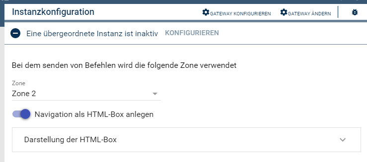
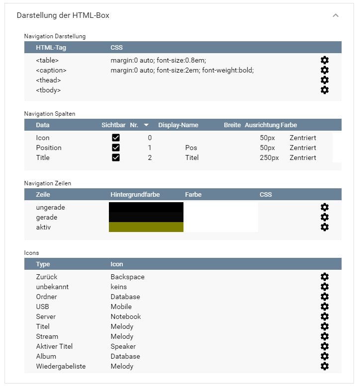
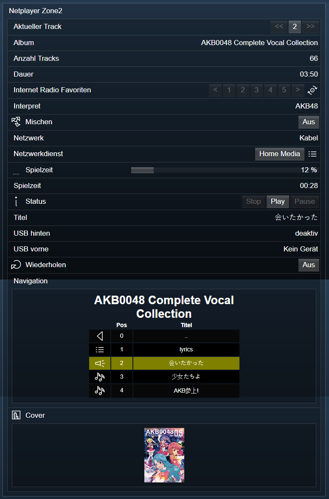

[](https://www.symcon.de/service/dokumentation/entwicklerbereich/sdk-tools/sdk-php/)
[](https://community.symcon.de/t/modul-onkyo-pioneer-avr/53213)
[](https://www.symcon.de/de/service/dokumentation/installation/migrationen/v80-v81-q3-2025/)  
[](https://creativecommons.org/licenses/by-nc-sa/4.0/)
[](https://github.com/Nall-chan/OnkyoAVR/actions) [](https://github.com/Nall-chan/OnkyoAVR/actions)  
[](#2-spenden)[](#2-spenden)

# Onkyo & Pioneer AVR NetPlayer (Onkyo Netplayer) <!-- omit in toc -->

Bildet die Netzwerkfunktionen eines AV Receiver in IP-Symcon ab.  

## Inhaltsverzeichnis  <!-- omit in toc -->

- [1. Funktionsumfang](#1-funktionsumfang)
- [2. Voraussetzungen](#2-voraussetzungen)
- [3. Software-Installation](#3-software-installation)
- [4. Einrichten der Instanzen in IP-Symcon](#4-einrichten-der-instanzen-in-ip-symcon)
- [5. Statusvariablen und Profile](#5-statusvariablen-und-profile)
- [6. Visualisierung](#6-visualisierung)
- [7. PHP-Befehlsreferenz](#7-php-befehlsreferenz)
- [8. Aktionen](#8-aktionen)
- [9. Anhang](#9-anhang)
  - [1. Changelog](#1-changelog)
  - [2. Spenden](#2-spenden)
- [10. Lizenz](#10-lizenz)

## 1. Funktionsumfang

- Darstellen von Zuständen des Netzwerkplayers.  
- Bedienung aus den Visualisierungen.  
- Bereitstellung von PHP-Befehlen zur Steuerung durch Scripte und Aktionen.  

## 2. Voraussetzungen

- Symcon ab Version 8.2  
- kompatibler AV-Receiver mit LAN-Anschluss  

## 3. Software-Installation

Dieses Modul ist ein Bestandteil des Symcon-Modul: [Onkyo & Pioneer AVR](../)  

## 4. Einrichten der Instanzen in IP-Symcon

Eine einfache Einrichtung ist über die im Objektbaum unter `Konfigurator` zu findende Instanz [Onkyo bzw Pioneer Configurator](../OnkyoConfigurator/) möglich.  

Bei der manuellen Einrichtung ist das Modul im Dialog `Instanz hinzufügen` unter den Hersteller `Onkyo` zu finden.  
  

In dem sich öffnenden Konfigurationsformular ist die gewünschte Zone auszuwählen, welche beim senden vom Kommandos an das Gerät benutzt wird.  
  

**Konfiguration HTML-Box zur Steuerung:**  
  

## 5. Statusvariablen und Profile

Jede Instanz erstellt einige Profile dynamisch, je nach Fähigkeiten der Geräte.  

**Statusvariablen MainZone:**  

| Name                     |   Typ   | Ident | Beschreibung                             |
| :----------------------- | :-----: | :---: | :--------------------------------------- |
| Internet Radio Favoriten | integer |  NPR  | Favorit aufrufen                         |
| Status                   | integer | NST0  | Status der Wiedergabe                    |
| Wiederholen              | integer | NST1  | Wiederholung durchschalten               |
| Mischen                  | integer | NST2  | Mischen durchschalten                    |
| Aktueller Track          | integer | NTR0  | Aktueller Track der Wiedergabe           |
| Anzahl Tracks            | integer | NTR1  | Anzahl von Tracks welche gespielt werden |
| Spielzeit                | string  | NTM0  | Aktuelle Position im aktuellen Track     |
| Dauer                    | string  | NTM1  | Laufzeit des Track                       |
| Spielzeit                | integer |  NTM  | Aktuelle Position in Prozent             |
| Album                    | string  |  NAL  | Album des aktuellen Track                |
| Titel                    | string  |  NTI  | Titel des aktuellen Track                |
| Interpret                | string  |  NAT  | Interpret des aktuellen Track            |
| Netzwerk                 | integer | NDS0  | Status Netzwerkanschluss                 |
| USB vorne                | integer | NDS1  | Erkanntes Gerät an USB-Anschluss         |
| USB hinten               | integer | NDS2  | Erkanntes Gerät an USB-Anschluss         |
| Netzwerkdienst           | integer |  NSV  | Aktiver Netzwerkdienst                   |
| Navigation               | string  |  NLA  | HTML-Box mit der Navigation              |

**Profile**:  

Alle Profile mit .* am Ende, enthalten immer die InstanzID und sind dynamische Profile.  
Diese können sich während des Betriebes, oder beim ändern von Geräteeinstellungen dynamisch verändern.  

| Name                         |   Typ   | verwendet von Statusvariablen  (Ident) |
| :--------------------------- | :-----: | :------------------------------------- |
| Onkyo.NetTunerPreset         | integer | NPR                                    |
| Onkyo.Status                 | integer | NST0                                   |
| Onkyo.Repeat.*               | integer | NST1                                   |
| Onkyo.Shuffle.*              | integer | NST2                                   |
| Onkyo.Tracks                 | integer | NTR0                                   |
| Onkyo.Network                | integer | NDS0                                   |
| Onkyo.USB                    | integer | NDS1, NDS2                             |
| Onkyo.SelectNetworkService.* | integer | NSV                                    |

## 6. Visualisierung

Die direkte Darstellung in den Visualisierungen ist möglich, es wird aber empfohlen mit Links zu arbeiten.  

**Beispiel Kachel Visualisierung:**  
  

**Beispiel WebFront:**  
  

## 7. PHP-Befehlsreferenz

**Schaltbare Statusvariablen können universell mit RequestAction angesteuert werden.**  
Siehe Symcon Dokumentation: [RequestAction](https://www.symcon.de/service/dokumentation/befehlsreferenz/variablenzugriff/requestaction/)

---  

**Folgende Funktionen liefern `TRUE` oder ein Array bei Erfolg.  
Im Fehlerfall wird eine Warnung erzeugt und `FALSE` zurückgegeben.**  

```php
bool OAVR_RequestState(int $InstanzID, string $Ident);
```

Fordert den aktuellen Wert einer Statusvariable beim Gerät an.  

---  

```php
bool OAVR_Menu(int $InstanzID);
```

Senden den Tastendruck `Menü` an das Gerät.  

---  

```php
bool OAVR_PreviousTrack(int $InstanzID);
```

Spring einen Track zurück.  

---  
  
```php
bool OAVR_NextTrack(int $InstanzID);
```

Springt einen Track vor.  
  
---  

```php
bool OAVR_Play(int $InstanzID);
```

Senden den Tastendruck `Play` an das Gerät.  
  
---  

```php
bool OAVR_Pause(int $InstanzID);
```

Senden den Tastendruck `Pause` an das Gerät.  
  
---  

```php
bool OAVR_Stop(int $InstanzID);
```

Senden den Tastendruck `Stop` an das Gerät.  
  
---  

```php
bool OAVR_Shuffle(int $InstanzID);
```

Senden den Tastendruck `Shuffle` an das Gerät.  
  
---  

```php
bool OAVR_Repeat(int $InstanzID);
```

Senden den Tastendruck `Repeat` an das Gerät.  
  
---  

```php
bool OAVR_SetPosition(int $InstanzID, int $Value);
```

Sprint an die in `$Value` angegeben Sekunden des aktuellen Track.  
  
---  

```php
bool OAVR_CallPreset(int $InstanzID, int $Value);
```

Ruft direkt den in `$Value` übergeben Favoriten auf.  
  
---  

```php
bool OAVR_SavePreset(int $InstanzID);
```

Speichert den Favoriten.  

---  

## 8. Aktionen

Die Instanz unterstützt aktuell keine Aktionen.  

## 9. Anhang

### 1. Changelog

[Changelog der Library](../README.md#2-changelog)

### 2. Spenden

Die Library ist für die nicht kommerzielle Nutzung kostenlos, Schenkungen als Unterstützung für den Autor werden hier akzeptiert:  

PayPal:  
[](https://paypal.me/Nall4chan)  

Wunschliste:  
[](https://www.amazon.de/hz/wishlist/ls/YU4AI9AQT9F?ref_=wl_share)  

## 10. Lizenz

IPS-Modul:  
[CC BY-NC-SA 4.0](https://creativecommons.org/licenses/by-nc-sa/4.0/)  
