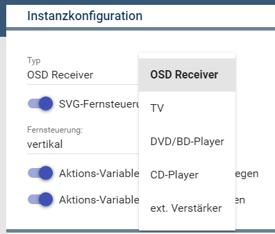
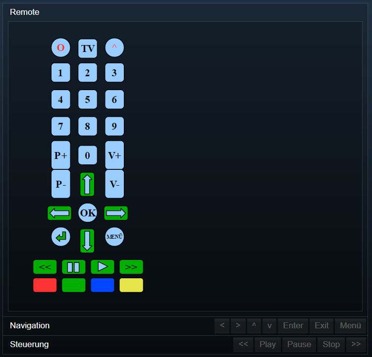

[](https://www.symcon.de/service/dokumentation/entwicklerbereich/sdk-tools/sdk-php/)
[]()
[](https://www.symcon.de/forum/threads/30857-IP-Symcon-5-1-%28Stable%29-Changelog)
[](https://creativecommons.org/licenses/by-nc-sa/4.0/)
[](https://github.com/Nall-chan/OnkyoAVR/actions) [](https://github.com/Nall-chan/OnkyoAVR/actions)  


# Onkyo & Pioneer AVR Remote (Onkyo Remote) <!-- omit in toc -->
Fernbedienung des AVR oder eines angeschlossenen Gerätes.  

## Inhaltsverzeichnis  <!-- omit in toc -->

- [1. Funktionsumfang](#1-funktionsumfang)
- [2. Voraussetzungen](#2-voraussetzungen)
- [3. Software-Installation](#3-software-installation)
- [4. Einrichten der Instanzen in IP-Symcon](#4-einrichten-der-instanzen-in-ip-symcon)
- [5. Statusvariablen und Profile](#5-statusvariablen-und-profile)
- [6. WebFront](#6-webfront)
- [7. PHP-Befehlsreferenz](#7-php-befehlsreferenz)
- [8. Lizenz](#8-lizenz)

## 1. Funktionsumfang

 - Bedienung aus dem WebFront.  
 - Bereitstellung von PHP-Befehlen zur Steuerung durch Scripte.  

## 2. Voraussetzungen

 - IPS ab Version 5.1  
 - kompatibler AV-Receiver mit LAN-Anschluss oder RS232 (RS232 Geräte haben einen eingeschränkten Leistungsumfang)  

## 3. Software-Installation

Dieses Modul ist ein Bestandteil des Symcon-Modul: [Onkyo & Pioneer AVR](../)  

## 4. Einrichten der Instanzen in IP-Symcon

Eine einfache Einrichtung ist über die im Objektbaum unter 'Konfigurator' zu findende Instanz [Onkyo bzw Pioneer Configurator'](../OnkyoConfigurator/) möglich.  

Bei der manuellen Einrichtung ist das Modul im Dialog 'Instanz hinzufügen' unter den Hersteller 'Onkyo' zu finden.  
  

In dem sich öffnenden Konfigurationsformular ist die gewünschte Fernbedienung auszuwählen.  
  

## 5. Statusvariablen und Profile

**Statusvariablen:**  

|    Name    |   Typ   |   Ident    |         Beschreibung         |
| :--------: | :-----: | :--------: | :--------------------------: |
|   Remote   | string  |   Remote   | Fernbedienung als SVG-Grafik |
| Navigation | integer | navremote  |      Navigationstasten       |
| Steuerung  | integer | ctrlremote |       Steuerungstasten       |

**Profile**:
 
|       Name       |   Typ   | verwendet von Statusvariablen  (Ident) |
| :--------------: | :-----: | :------------------------------------: |
| Onkyo.Navigation | integer |               Navigation               |
|  Onkyo.Control   | integer |               Steuerung                |


## 6. WebFront

Die direkte Darstellung im WebFront ist möglich, es wird aber empfohlen mit Links zu arbeiten.  

  


## 7. PHP-Befehlsreferenz

**Schaltbare Statusvariablen können universell mit RequestAction angesteuert werden.**  
Siehe Symcon Dokumentation: [RequestAction](https://www.symcon.de/service/dokumentation/befehlsreferenz/variablenzugriff/requestaction/)

---  

**Folgende Funktionen liefern 'TRUE' bei Erfolg.  
Im Fehlerfall wird eine Warnung erzeugt und 'FALSE' zurückgegeben.**  


```php
bool OAVR_Up(int $InstanzeID);
```
Senden den Tastendruck 'Up' an das Gerät.  

```php
bool OAVR_Down(int $InstanzeID);
```
Senden den Tastendruck 'Down' an das Gerät.  

```php
bool OAVR_Left(int $InstanzeID);
```
Senden den Tastendruck 'Left' an das Gerät.  

```php
bool OAVR_Right(int $InstanzeID);
```
Senden den Tastendruck 'Right' an das Gerät.  

```php
bool OAVR_Menu(int $InstanzeID);
```
Senden den Tastendruck 'Menü' an das Gerät.  

```php
bool OAVR_Enter(int $InstanzeID);
```
Senden den Tastendruck 'Enter' an das Gerät.  

```php
bool OAVR_Home(int $InstanzeID);
```
Senden den Tastendruck 'Home' an das Gerät.  

```php
bool OAVR_Exit(int $InstanzeID);
```
Senden den Tastendruck 'Exit' an das Gerät.  

```php
bool OAVR_Quick(int $InstanzeID);
```
Senden den Tastendruck 'Quick' an das Gerät.  

```php
bool OAVR_Power(int $InstanzeID);
```
Senden den Tastendruck 'Power' an das Gerät.  
Dies kann Einschalten, oder Ausschalten, oder Umschalten bedeuten!  

```php
bool OAVR_PowerOn(int $InstanzeID);
```
Senden den Tastendruck 'PowerOn' an das Gerät.  

```php
bool OAVR_PowerOff(int $InstanzeID);
```
Senden den Tastendruck 'PowerOff' an das Gerät.  

```php
bool OAVR_Mute(int $InstanzeID);
```
Senden den Tastendruck 'Mute' an das Gerät.  
Dies kann Einschalten, oder Ausschalten, oder Umschalten bedeuten!  

```php
bool OAVR_Input(int $InstanzeID);
```
Senden den Tastendruck 'Input' bzw. 'Source' an das Gerät.  

```php
bool OAVR_Setup(int $InstanzeID);
```
Senden den Tastendruck 'Setup' an das Gerät.  

```php
bool OAVR_Return(int $InstanzeID);
```
Senden den Tastendruck 'Return' an das Gerät.  

```php
bool OAVR_ChannelDown(int $InstanzeID);
```
Senden den Tastendruck 'CHDN' an das Gerät.  

```php
bool OAVR_ChannelUp(int $InstanzeID);
```
Senden den Tastendruck 'CHUP' an das Gerät.  

```php
bool OAVR_VolumeDown(int $InstanzeID);
```
Senden den Tastendruck 'MVLDOWN' (Master Volume) bzw. 'VLDN' (Volume) an das Gerät.  

```php
bool OAVR_VolumeUp(int $InstanzeID);
```
Senden den Tastendruck 'MVLUP' (Master Volume) bzw. 'MVLUP' (Volume) an das Gerät.  

```php
bool OAVR_Play(int $InstanzeID);
```
Senden den Tastendruck 'Play' an das Gerät.  
  
```php
bool OAVR_Pause(int $InstanzeID);
```
Senden den Tastendruck 'Pause' an das Gerät.  
  
```php
bool OAVR_Stop(int $InstanzeID);
```
Senden den Tastendruck 'Stop' an das Gerät.  
  
```php
bool OAVR_Back(int $InstanzeID);
```
Senden den Tastendruck 'SKIP.R' (Titel/Track zurück) an das Gerät.  
  
```php
bool OAVR_Next(int $InstanzeID);
```
Senden den Tastendruck 'SKIP.F' (Titel/Track weiter) an das Gerät.  

```php
bool OAVR_SendKey(int $InstanzeID, string $Value);
```
Senden die in '$Value' übergebene Taste als Tastendruck an das Gerät.  
  
Folgende Werte sind je nach eingestellten Typ der Instanz möglich:
**OSD (Receiver)**:  
            'MENU',
            'UP',
            'DOWN',
            'RIGHT',
            'LEFT',
            'ENTER',
            'EXIT',
            'AUDIO',
            'VIDEO',
            'HOME',
            'QUICK',
            'RETURN'

**CTV (TV Gerät)**:  
            'POWER',
            'PWRON',
            'PWROFF',
            'CHUP',
            'CHDN',
            'VLUP',
            'VLDN',
            'MUTE',
            'DISP',
            'INPUT',
            '1',
            '2',
            '3',
            '4',
            '5',
            '6',
            '7',
            '8',
            '9',
            '0',
            'CLEAR',
            'SETUP',
            'GUIDE',
            'PREV',
            'UP',
            'DOWN',
            'LEFT',
            'RIGHT',
            'ENTER',
            'RETURN',
            'A',
            'B',
            'C',
            'D' 

**CDV (DVD/BD-Player)**:  
            'POWER',
            'PWRON',
            'PWROFF',
            'PLAY',
            'STOP',
            'SKIP.F',
            'SKIP.R',
            'FF',
            'REW',
            'PAUSE',
            'LASTPLAY',
            'SUBTON/OFF',
            'SUBTITLE',
            'SETUP',
            'TOPMENU',
            'MENU',
            'UP',
            'DOWN',
            'LEFT',
            'RIGHT',
            'ENTER',
            'RETURN',
            'DISC.F',
            'DISC.R',
            'AUDIO',
            'RANDOM',
            'OP/CL',
            'ANGLE',
            '1',
            '2',
            '3',
            '4',
            '5',
            '6',
            '7',
            '8',
            '9',
            '10',
            '0',
            'SEARCH',
            'DISP',
            'REPEAT',
            'MEMORY',
            'CLEAR',
            'ABR',
            'STEP.F',
            'STEP.R',
            'SLOW.F',
            'SLOW.R',
            'ZOOMTG',
            'ZOOMUP',
            'ZOOMDN',
            'PROGRE',
            'VDOFF',
            'CONMEM',
            'FUNMEM',
            'DISC1',
            'DISC2',
            'DISC3',
            'DISC4',
            'DISC5',
            'DISC6',
            'FOLDUP',
            'FOLDDN',
            'P.MODE',
            'ASCTG',
            'CDPCD',
            'MSPUP',
            'MSPDN',
            'PCT',
            'RSCTG',
            'INIT'

**CCD (CD-Player)**:  
            'POWER',
            'TRACK',
            'PLAY',
            'STOP',
            'PAUSE',
            'SKIP.F',
            'SKIP.R',
            'MEMORY',
            'CLEAR',
            'REPEAT',
            'RANDOM',
            'DISP',
            'D.MODE',
            'FF',
            'REW',
            'OP/CL',
            '1',
            '2',
            '3',
            '4',
            '5',
            '6',
            '7',
            '8',
            '9',
            '0',
            '10',
            '+10',
            'D.SKIP',
            'DISC.F',
            'DISC.R',
            'DISC1',
            'DISC2',
            'DISC3',
            'DISC4',
            'DISC5',
            'DISC6',
            'STBY',
            'PON'

**CAP (ext. Verstärker)**:  
          'MVLUP',
            'MVLDOWN',
            'SLIUP',
            'SLIDOWN',
            'AMTON',
            'AMTOFF',
            'AMTTG',
            'PWRON',
            'PWROFF',
            'PWRTG'

## 8. Lizenz

  IPS-Modul:  
  [CC BY-NC-SA 4.0](https://creativecommons.org/licenses/by-nc-sa/4.0/)  
