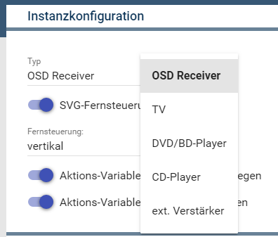
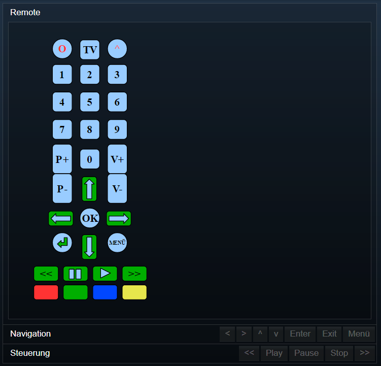

[](https://www.symcon.de/service/dokumentation/entwicklerbereich/sdk-tools/sdk-php/)
[](https://community.symcon.de/t/modul-onkyo-pioneer-avr/53213)
[](https://www.symcon.de/de/service/dokumentation/installation/migrationen/v80-v81-q3-2025/)  
[](https://creativecommons.org/licenses/by-nc-sa/4.0/)
[](https://github.com/Nall-chan/OnkyoAVR/actions) [](https://github.com/Nall-chan/OnkyoAVR/actions)  
[](#2-spenden)[](#2-spenden)

# Onkyo & Pioneer AVR Remote (Onkyo Remote) <!-- omit in toc -->

Fernbedienung des AVR oder eines angeschlossenen Gerätes.  

## Inhaltsverzeichnis  <!-- omit in toc -->

- [1. Funktionsumfang](#1-funktionsumfang)
- [2. Voraussetzungen](#2-voraussetzungen)
- [3. Software-Installation](#3-software-installation)
- [4. Einrichten der Instanzen in IP-Symcon](#4-einrichten-der-instanzen-in-ip-symcon)
- [5. Statusvariablen und Profile](#5-statusvariablen-und-profile)
- [6. Visualisierung](#6-visualisierung)
- [7. PHP-Befehlsreferenz](#7-php-befehlsreferenz)
- [8. Aktionen](#8-aktionen)
- [9. Anhang](#9-anhang)
  - [1. Changelog](#1-changelog)
  - [2. Spenden](#2-spenden)
- [10. Lizenz](#10-lizenz)

## 1. Funktionsumfang

- Bedienung aus den Visualisierungen.  
- Bereitstellung von PHP-Befehlen zur Steuerung durch Scripte.  

## 2. Voraussetzungen

- Symcon ab Version 8.2  
- kompatibler AV-Receiver mit LAN-Anschluss oder RS232 (RS232 Geräte haben einen eingeschränkten Leistungsumfang)  

## 3. Software-Installation

Dieses Modul ist ein Bestandteil des Symcon-Modul: [Onkyo & Pioneer AVR](../)  

## 4. Einrichten der Instanzen in IP-Symcon

Eine einfache Einrichtung ist über die im Objektbaum unter `Konfigurator` zu findende Instanz [Onkyo bzw Pioneer Configurator](../OnkyoConfigurator/) möglich.  

Bei der manuellen Einrichtung ist das Modul im Dialog `Instanz hinzufügen` unter den Hersteller `Onkyo` zu finden.  
  

In dem sich öffnenden Konfigurationsformular ist die gewünschte Fernbedienung auszuwählen.  
  

## 5. Statusvariablen und Profile

**Statusvariablen:**  

| Name       |   Typ   |   Ident    | Beschreibung                 |
| :--------- | :-----: | :--------: | :--------------------------- |
| Remote     | string  |   Remote   | Fernbedienung als SVG-Grafik |
| Navigation | integer | navremote  | Navigationstasten            |
| Steuerung  | integer | ctrlremote | Steuerungstasten             |

**Profile**:

| Name             |   Typ   | verwendet von Statusvariablen  (Ident) |
| :--------------- | :-----: | :------------------------------------- |
| Onkyo.Navigation | integer | Navigation                             |
| Onkyo.Control    | integer | Steuerung                              |

## 6. Visualisierung

Die direkte Darstellung in den Visualisierungen ist möglich, es wird aber empfohlen mit Links zu arbeiten.  

**Beispiel Kachel-Visualisierung:**  
  

**Beispiel WebFront:**  
  

## 7. PHP-Befehlsreferenz

**Schaltbare Statusvariablen können universell mit RequestAction angesteuert werden.**  
Siehe Symcon Dokumentation: [RequestAction](https://www.symcon.de/service/dokumentation/befehlsreferenz/variablenzugriff/requestaction/)

---  

**Folgende Funktionen liefern `TRUE` bei Erfolg.  
Im Fehlerfall wird eine Warnung erzeugt und `FALSE` zurückgegeben.**  

```php
bool OAVR_Up(int $InstanzID);
```

Senden den Tastendruck `Up` an das Gerät.  

---  

```php
bool OAVR_Down(int $InstanzID);
```

Senden den Tastendruck `Down` an das Gerät.  

---  

```php
bool OAVR_Left(int $InstanzID);
```

Senden den Tastendruck `Left` an das Gerät.  

---  

```php
bool OAVR_Right(int $InstanzID);
```

Senden den Tastendruck `Right` an das Gerät.  

---  

```php
bool OAVR_Menu(int $InstanzID);
```

Senden den Tastendruck `Menü` an das Gerät.  

---  

```php
bool OAVR_Enter(int $InstanzID);
```

Senden den Tastendruck `Enter` an das Gerät.  

---  

```php
bool OAVR_Home(int $InstanzID);
```

Senden den Tastendruck `Home` an das Gerät.  

---  

```php
bool OAVR_Exit(int $InstanzID);
```

Senden den Tastendruck `Exit` an das Gerät.  

---  

```php
bool OAVR_Quick(int $InstanzID);
```

Senden den Tastendruck `Quick` an das Gerät.  

---  

```php
bool OAVR_Power(int $InstanzID);
```

Senden den Tastendruck `Power` an das Gerät.  
Dies kann Einschalten, oder Ausschalten, oder Umschalten bedeuten!  

---  

```php
bool OAVR_PowerOn(int $InstanzID);
```

Senden den Tastendruck `PowerOn` an das Gerät.  

---  

```php
bool OAVR_PowerOff(int $InstanzID);
```

Senden den Tastendruck `PowerOff` an das Gerät.  

---  

```php
bool OAVR_Mute(int $InstanzID);
```

Senden den Tastendruck `Mute` an das Gerät.  
Dies kann Einschalten, oder Ausschalten, oder Umschalten bedeuten!  

---  

```php
bool OAVR_Input(int $InstanzID);
```

Senden den Tastendruck `Input` bzw. `Source` an das Gerät.  

---  

```php
bool OAVR_Setup(int $InstanzID);
```

Senden den Tastendruck `Setup` an das Gerät.  

---  

```php
bool OAVR_Return(int $InstanzID);
```

Senden den Tastendruck `Return` an das Gerät.  

---  

```php
bool OAVR_ChannelDown(int $InstanzID);
```

Senden den Tastendruck `CHDN` an das Gerät.  

---  

```php
bool OAVR_ChannelUp(int $InstanzID);
```

Senden den Tastendruck `CHUP` an das Gerät.  

---  

```php
bool OAVR_VolumeDown(int $InstanzID);
```

Senden den Tastendruck `MVLDOWN` (Master Volume) bzw. `VLDN` (Volume) an das Gerät.  

---  

```php
bool OAVR_VolumeUp(int $InstanzID);
```

Senden den Tastendruck `MVLUP` (Master Volume) bzw. `MVLUP` (Volume) an das Gerät.  

---  

```php
bool OAVR_Play(int $InstanzID);
```

Senden den Tastendruck `Play` an das Gerät.  

---  
  
```php
bool OAVR_Pause(int $InstanzID);
```

Senden den Tastendruck `Pause` an das Gerät.  

---  
  
```php
bool OAVR_Stop(int $InstanzID);
```

Senden den Tastendruck `Stop` an das Gerät.  

---  
  
```php
bool OAVR_Back(int $InstanzID);
```

Senden den Tastendruck `SKIP.R` (Titel/Track zurück) an das Gerät.  

---  
  
```php
bool OAVR_Next(int $InstanzID);
```

Senden den Tastendruck `SKIP.F` (Titel/Track weiter) an das Gerät.  

---  

```php
bool OAVR_SendKey(int $InstanzID, string $Value);
```

Senden die in `$Value` übergebene Taste als Tastendruck an das Gerät.  
  
Folgende Werte sind je nach eingestellten Typ der Instanz möglich:
**OSD (Receiver)**:  
            `MENU`,
            `UP`,
            `DOWN`,
            `RIGHT`,
            `LEFT`,
            `ENTER`,
            `EXIT`,
            `AUDIO`,
            `VIDEO`,
            `HOME`,
            `QUICK`,
            `RETURN`

**CTV (TV Gerät)**:  
            `POWER`,
            `PWRON`,
            `PWROFF`,
            `CHUP`,
            `CHDN`,
            `VLUP`,
            `VLDN`,
            `MUTE`,
            `DISP`,
            `INPUT`,
            `1`,
            `2`,
            `3`,
            `4`,
            `5`,
            `6`,
            `7`,
            `8`,
            `9`,
            `0`,
            `CLEAR`,
            `SETUP`,
            `GUIDE`,
            `PREV`,
            `UP`,
            `DOWN`,
            `LEFT`,
            `RIGHT`,
            `ENTER`,
            `RETURN`,
            `A`,
            `B`,
            `C`,
            `D`  

**CDV (DVD/BD-Player)**:  
            `POWER`,
            `PWRON`,
            `PWROFF`,
            `PLAY`,
            `STOP`,
            `SKIP.F`,
            `SKIP.R`,
            `FF`,
            `REW`,
            `PAUSE`,
            `LASTPLAY`,
            `SUBTON/OFF`,
            `SUBTITLE`,
            `SETUP`,
            `TOPMENU`,
            `MENU`,
            `UP`,
            `DOWN`,
            `LEFT`,
            `RIGHT`,
            `ENTER`,
            `RETURN`,
            `DISC.F`,
            `DISC.R`,
            `AUDIO`,
            `RANDOM`,
            `OP/CL`,
            `ANGLE`,
            `1`,
            `2`,
            `3`,
            `4`,
            `5`,
            `6`,
            `7`,
            `8`,
            `9`,
            `10`,
            `0`,
            `SEARCH`,
            `DISP`,
            `REPEAT`,
            `MEMORY`,
            `CLEAR`,
            `ABR`,
            `STEP.F`,
            `STEP.R`,
            `SLOW.F`,
            `SLOW.R`,
            `ZOOMTG`,
            `ZOOMUP`,
            `ZOOMDN`,
            `PROGRE`,
            `VDOFF`,
            `CONMEM`,
            `FUNMEM`,
            `DISC1`,
            `DISC2`,
            `DISC3`,
            `DISC4`,
            `DISC5`,
            `DISC6`,
            `FOLDUP`,
            `FOLDDN`,
            `P.MODE`,
            `ASCTG`,
            `CDPCD`,
            `MSPUP`,
            `MSPDN`,
            `PCT`,
            `RSCTG`,
            `INIT`

**CCD (CD-Player)**:  
            `POWER`,
            `TRACK`,
            `PLAY`,
            `STOP`,
            `PAUSE`,
            `SKIP.F`,
            `SKIP.R`,
            `MEMORY`,
            `CLEAR`,
            `REPEAT`,
            `RANDOM`,
            `DISP`,
            `D.MODE`,
            `FF`,
            `REW`,
            `OP/CL`,
            `1`,
            `2`,
            `3`,
            `4`,
            `5`,
            `6`,
            `7`,
            `8`,
            `9`,
            `0`,
            `10`,
            `+10`,
            `D.SKIP`,
            `DISC.F`,
            `DISC.R`,
            `DISC1`,
            `DISC2`,
            `DISC3`,
            `DISC4`,
            `DISC5`,
            `DISC6`,
            `STBY`,
            `PON`

**CAP (ext. Verstärker)**:  
            `MVLUP`,
            `MVLDOWN`,
            `SLIUP`,
            `SLIDOWN`,
            `AMTON`,
            `AMTOFF`,
            `AMTTG`,
            `PWRON`,
            `PWROFF`,
            `PWRTG`

## 8. Aktionen

Die Instanz unterstützt aktuell keine Aktionen.  

## 9. Anhang

### 1. Changelog

[Changelog der Library](../README.md#2-changelog)

### 2. Spenden

Die Library ist für die nicht kommerzielle Nutzung kostenlos, Schenkungen als Unterstützung für den Autor werden hier akzeptiert:  

PayPal:  
[](https://paypal.me/Nall4chan)  

Wunschliste:  
[](https://www.amazon.de/hz/wishlist/ls/YU4AI9AQT9F?ref_=wl_share)  

## 10. Lizenz

IPS-Modul:  
[CC BY-NC-SA 4.0](https://creativecommons.org/licenses/by-nc-sa/4.0/)  
