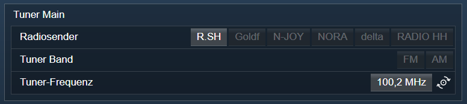

[](https://www.symcon.de/service/dokumentation/entwicklerbereich/sdk-tools/sdk-php/)
[](https://community.symcon.de/t/modul-onkyo-pioneer-avr/53213)
[](https://www.symcon.de/de/service/dokumentation/installation/migrationen/v80-v81-q3-2025/)  
[](https://creativecommons.org/licenses/by-nc-sa/4.0/)
[](https://github.com/Nall-chan/OnkyoAVR/actions) [](https://github.com/Nall-chan/OnkyoAVR/actions)  
[](#2-spenden)[](#2-spenden)

# Onkyo & Pioneer Tuner (Onkyo Tuner) <!-- omit in toc -->

Bildet einen Tuner eines Gerätes in IP-Symcon ab.  

## Inhaltsverzeichnis  <!-- omit in toc -->

- [1. Funktionsumfang](#1-funktionsumfang)
- [2. Voraussetzungen](#2-voraussetzungen)
- [3. Software-Installation](#3-software-installation)
- [4. Einrichten der Instanzen in IP-Symcon](#4-einrichten-der-instanzen-in-ip-symcon)
- [5. Statusvariablen und Profile](#5-statusvariablen-und-profile)
- [6. Visualisierung](#6-visualisierung)
- [7. PHP-Befehlsreferenz](#7-php-befehlsreferenz)
- [8. Aktionen](#8-aktionen)
- [9. Anhang](#9-anhang)
  - [1. Changelog](#1-changelog)
  - [2. Spenden](#2-spenden)
- [10. Lizenz](#10-lizenz)

## 1. Funktionsumfang

- Darstellen von Zuständen des Tuners.  
- Bedienung aus dem WebFront.  
- Bereitstellung von PHP-Befehlen zur Steuerung durch Scripte.  

## 2. Voraussetzungen

- Symcon ab Version 8.2  
- kompatibler AV-Receiver mit LAN-Anschluss oder RS232 (RS232 Geräte haben einen eingeschränkten Leistungsumfang)  

## 3. Software-Installation

Dieses Modul ist ein Bestandteil des Symcon-Modul: [Onkyo & Pioneer AVR](../)  

## 4. Einrichten der Instanzen in IP-Symcon

Eine einfache Einrichtung ist über die im Objektbaum unter `Konfigurator` zu findende Instanz [Onkyo bzw Pioneer Configurator](../OnkyoConfigurator/readme.md) möglich.  

Bei der manuellen Einrichtung ist das Modul im Dialog `Instanz hinzufügen` unter den Hersteller `Onkyo` zu finden.  
  

In dem sich öffnenden Konfigurationsformular ist die gewünschte Zone auszuwählen, welche beim senden vom Kommandos an das Gerät benutzt wird.  
  

## 5. Statusvariablen und Profile

Jede Instanz erstellt einige Profile dynamisch, je nach Fähigkeiten der Geräte.  

**Statusvariablen MainZone:**  

| Name           |   Typ   | Ident | Beschreibung                          |
| :------------- | :-----: | :---: | :------------------------------------ |
| Tuner Band     | integer |  SLI  | Aktive Quelle der Zone                |
| Radiosender    | integer |  PRS  | Aktueller Speicherplatz eines Senders |
| Tuner-Frequenz |  float  |  TUN  | Aktuelle Frequenz                     |

**Profile**:

Alle Profile mit .* am Ende, enthalten immer die InstanzID und sind dynamische Profile.  
Diese können sich während des Betriebes, oder beim ändern von Geräteeinstellungen dynamisch verändern.  

| Name                |   Typ   | verwendet von Statusvariablen  (Ident) |
| :------------------ | :-----: | :------------------------------------- |
| Onkyo.TunerBand.*   | integer | SLI                                    |
| Onkyo.TunerPreset.* | integer | PRS                                    |
| Onkyo.TunerFreq.*   |  float  | TUN                                    |

## 6. Visualisierung

Die direkte Darstellung in den Visualisierungen ist möglich, es wird aber empfohlen mit Links zu arbeiten.  

**Beispiel Kachel-Visualisierung:**  
  

**Beispiel WebFront:**  
  

## 7. PHP-Befehlsreferenz

**Schaltbare Statusvariablen können universell mit RequestAction angesteuert werden.**  
Siehe Symcon Dokumentation: [RequestAction](https://www.symcon.de/service/dokumentation/befehlsreferenz/variablenzugriff/requestaction/)

---  

**Folgende Funktionen liefern `TRUE` bei Erfolg.  
Im Fehlerfall wird eine Warnung erzeugt und `FALSE` zurückgegeben.**  

```php
bool OAVR_RequestState(int $InstanzID, string $Ident);
```

Fordert den aktuellen Wert einer Statusvariable beim Gerät an.  

---  

```php
bool OAVR_SetBand(int $InstanzID, int $Value);
```

Schaltes auf das in `$Value` angegeben Frequenzband um.  
Hierbei entspricht der Wert 0x24 dem FM und 0x25 dem AM Band.  

---  

```php
bool OAVR_SetFrequency(int $InstanzID, float $Value);
```

Setzt den Tuner auf die in `$Value` übergebenen Frequenz.
`$Value` besitzt keine Einheit, somit sind z.B. 100,2 ein gültiger Wert für 100,2 MHz FM, und 702 ein gültiger Wert für 702 kHz.  
Es wird dabei wird automatisch zwischen AM und FM umgeschaltet.  

---  
  
```php
bool OAVR_CallPreset(int $InstanzID, int $Value);
```

Ruft direkt den in `$Value` übergeben Sender auf auf.  

---  
  
```php
bool OAVR_SetPreset(int $InstanzID, int $Value);
```

Speichert die aktuelle Frequenz in den in `$Value` übergebenen Speicherplatz.  

## 8. Aktionen

Die Discovery-Instanz unterstützt keine Aktionen.  

## 9. Anhang

### 1. Changelog

[Changelog der Library](../README.md#2-changelog)

### 2. Spenden

Die Library ist für die nicht kommerzielle Nutzung kostenlos, Schenkungen als Unterstützung für den Autor werden hier akzeptiert:  

PayPal:  
[](https://paypal.me/Nall4chan)  

Wunschliste:  
[](https://www.amazon.de/hz/wishlist/ls/YU4AI9AQT9F?ref_=wl_share)  

## 10. Lizenz

IPS-Modul:  
[CC BY-NC-SA 4.0](https://creativecommons.org/licenses/by-nc-sa/4.0/)  
