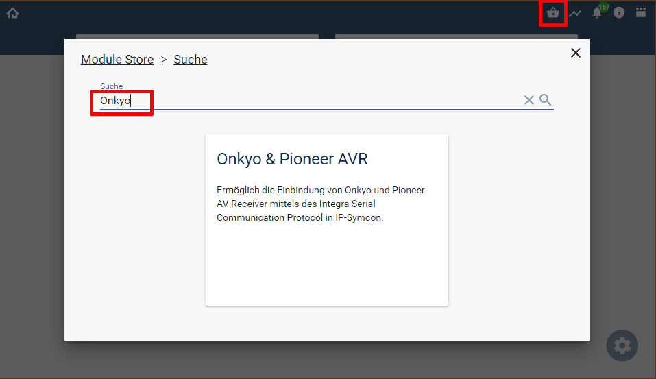

  

   

# Symcon-Modul: Onkyo & Pioneer AVR <!-- omit in toc -->

Diese Implementierung des Integra Serial Communication Protokolls  
ermöglicht die Einbindung von Onkyo und Pioneer AV-Receiver in Symcon.  

## Inhaltsverzeichnis <!-- omit in toc -->

- [1. Funktionsumfang](#1-funktionsumfang)
  - [OnkyoAVRDiscovery](#onkyoavrdiscovery)
  - [OnkyoConfigurator](#onkyoconfigurator)
  - [OnkyoAVRSplitter](#onkyoavrsplitter)
  - [OnkyoAVRZone](#onkyoavrzone)
  - [OnkyoNetplayer](#onkyonetplayer)
  - [OnkyoRemote](#onkyoremote)
  - [OnkyoTuner](#onkyotuner)
- [2. Voraussetzungen](#2-voraussetzungen)
- [3. Software-Installation](#3-software-installation)
- [4. Einrichten der Instanzen in IP-Symcon](#4-einrichten-der-instanzen-in-ip-symcon)
- [5. Anhang](#5-anhang)
  - [1. GUID der Module](#1-guid-der-module)
  - [2. Changelog](#2-changelog)
  - [3. Spenden](#3-spenden)
- [6. Lizenz](#6-lizenz)

## 1. Funktionsumfang

### [OnkyoAVRDiscovery](OnkyoAVRDiscovery/)  

Ermöglicht das einfache Erkennen von Geräten im Netzwerk und anschließende anlegen eines Konfigurator in Symcon.  

### [OnkyoConfigurator](OnkyoConfigurator/)

Bei unterstützen Geräten listet der Konfigurator alle möglichen Instanzen auf, welche in Symcon angelegt werden können.  

### [OnkyoAVRSplitter](OnkyoAVRSplitter/)

Der Splitter dient zur Kommunikation mit dem Gerät und unterstützt Netzwerk, als auch Geräte welche per RS232 angebunden sind.  

### [OnkyoAVRZone](OnkyoAVRZone/)

Dieses Modul bildet jeweils eine Zone des Gerätes ab.  

### [OnkyoNetplayer](OnkyoNetplayer/)

Über dieses Modul werden die Player Funktionen der Netzwerk-Geräte abgebildet.  

### [OnkyoRemote](OnkyoRemote/)

Je nach Fähigkeiten des Receivers können per HDMI-CEC angeschlossene Geräte ferngesteuert werden, zusätzlich zum Receiver selber.  

### [OnkyoTuner](OnkyoTuner/)

Dient der Integration der Tuner in Symcon.  

## 2. Voraussetzungen

- Symcon ab Version 8.2
- kompatibler AV-Receiver mit LAN oder RS232-Anschluss(*)

(*) RS232-Geräte/Anbindung bieten eventuell nicht den vollen Funktionsumfang.  

## 3. Software-Installation

Über den `Module-Store` in Symcon das Modul `Onkyo & Pioneer AVR` hinzufügen.  
**Bei kommerzieller Nutzung (z.B. als Errichter oder Integrator) wenden Sie sich bitte an den Autor.**  
  

## 4. Einrichten der Instanzen in IP-Symcon

Ist direkt in der Dokumentation der jeweiligen Module beschrieben.  
Es wird empfohlen, bei Netzwerkgeräten, die Einrichtung mit der Discovery-Instanz zu starten ([OnkyoAVRDiscovery](OnkyoAVRDiscovery/)).  
Soll ein Receiver per RS232 angebunden werden, so ist zuerst ein ([OnkyoConfigurator](OnkyoConfigurator/README.md)) anzulegen.  

## 5. Anhang

### 1. GUID der Module

| Modul               |     Typ      | Prefix |                  GUID                  |
| :------------------ | :----------: | :----: | :------------------------------------: |
| Onkyo AVR Discovery |  Discovery   |  OAVR  | {7A3A7067-253F-4270-AC6D-55790FB12F53} |
| Onkyo Configurator  | Configurator |  OAVR  | {251DAC2C-5B1F-4B1F-B843-B22D518F553E} |
| ISCP Splitter       |   Splitter   |  OAVR  | {EB1697D1-2A88-4A1A-89D9-807D73EEA7C9} |
| Onkyo AVR Zone      |    Device    |  OAVR  | {DEDC12F1-4CF7-4DD1-AE21-B03D7A7FADD7} |
| Onkyo Netplayer     |    Device    |  OAVR  | {3E71DC11-1A93-46B1-9EA0-F0EC0C1B3476} |
| Onkyo Tuner         |    Device    |  OAVR  | {47D1BFF5-B6A6-4C3A-A11F-CDA656E3D85F} |
| Onkyo Remote        |    Device    |  OAVR  | {C7EA583D-2BAC-41B7-A85A-AD0DF648E514} |

### 2. Changelog

**Version 3.00:**  

- Umstellung von Profilen auf Darstellungen  
- Refactoring  
- Dokumentation überarbeitet  

**Version 2.01:**  

- OAVR_GetVideoInformation und OAVR_GetAudioInformation haben Fehler verursacht und ein falsches Array zurück gegeben  

**Version 2.0:**  

- Modul für Symcon 5.1 komplett überarbeitet  
- Neue Discovery Instanz zum auffinden und einrichten von Geräten in Symcon  
- Neue Konfigurator Instanz zum einfachen einrichten der Geräte Instanzen in Symcon  
- Neue Instanzen für Tuner, Netplayer und Fernsteuerung (Remote)  
- Profile folgen dem Muster Onkyo.\<Name\>  
- Zonen können detaillierter Konfiguriert werden und unterstützen mehr Funktionen  
- Übersetzungen hinzugefügt  
- Automatische Erkennung der verfügbaren Eingänge und Wertebereiche für u.a. Lautstärke und Pegelanpassung  

**Version 0.4:**  

- Bugfix für Symcon 5.0  

**Version 0.3:**  

- Bugfix Datenaustausch aus 0.2  

**Version 0.2:**  

- Bugfix Timer & Datenaustausch. Doku falsch / fehlt noch immer. Umbau auf RC Beta1 folgt.  

**Version 0.1:**  

- Testversion  

### 3. Spenden  
  
Die Library ist für die nicht kommerzielle Nutzung kostenlos, Schenkungen als Unterstützung für den Autor werden hier akzeptiert:  

  

  

## 6. Lizenz

IPS-Modul:  
[CC BY-NC-SA 4.0](https://creativecommons.org/licenses/by-nc-sa/4.0/)  
